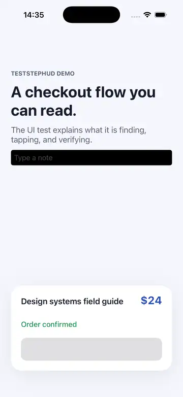

<div align="center">

# TestStepHUD

**Make every XCUITest recording explain itself.**

[](https://swift.org)
[](https://developer.apple.com/ios/)
[](https://www.swift.org/package-manager/)
[](https://github.com/kei-sidorov/TestStepHUD/releases)
[](LICENSE)

<a href="Docs/Assets/teststephud-demo.mp4">
  
</a>

<sub>
Typing, swipe, long press, drag, coordinate tap, and double tap.
<a href="Docs/Assets/teststephud-demo.mp4">Watch the MP4 demo.</a>
</sub>

</div>

TestStepHUD adds a readable, non-interactive HUD to recorded XCUITest runs. A
test names the current step, the app displays it, and the action begins only
after the HUD is on screen.

Regular XCUITest calls need no wrappers. Taps flash their target, swipes draw a
directional arrow, typing marks the input, and drags show their path. The
result is a recording that communicates both **what the test expects** and
**where it interacts**.

## Why TestStepHUD?

- **Readable test intent.** Step text remains visible while the test acts.
- **Visible interactions.** Common element and coordinate actions are
  visualized automatically.
- **Synchronized recordings.** The test waits for app-side layout before
  continuing.
- **Zero production behavior.** `TestStepHUD.install()` is a strict no-op
  outside an authenticated HUD test session.
- **Safe overlay.** The HUD never becomes key, never handles touches, and is
  hidden from accessibility.
- **No service dependencies.** No URL schemes, App Groups, entitlements,
  fixed ports, or third-party runtime packages.

## Requirements

- iOS 16 or later
- Xcode 15 or later
- Swift 5.9 or later
- Swift Package Manager

The current test matrix uses Xcode 26.4.1 with iOS 16.0 and iOS 26.1
Simulators. See [Compatibility](#compatibility) for details.

## Installation

### Xcode

In **File → Add Package Dependencies**, enter:

```text
https://github.com/kei-sidorov/TestStepHUD
```

Link the products to different targets:

| Product | Target |
| --- | --- |
| `TestStepHUD` | Application |
| `TestStepHUDTestSupport` | UI tests |

### Package.swift

```swift
dependencies: [
    .package(
        url: "https://github.com/kei-sidorov/TestStepHUD.git",
        from: "0.1.0"
    )
]
```

Use `TestStepHUD` only from the application target and
`TestStepHUDTestSupport` only from the UI-test target.

## Quick start

### 1. Install the app-side receiver

Call `install()` once during application launch:

```swift
import TestStepHUD

func application(
    _ application: UIApplication,
    didFinishLaunchingWithOptions launchOptions: [
        UIApplication.LaunchOptionsKey: Any
    ]?
) -> Bool {
    TestStepHUD.install()
    return true
}
```

It is safe to leave this line in every build configuration. Without valid
TestStepHUD launch metadata, it creates no connection, window, or observers.

### 2. Describe the UI-test flow

```swift
import XCTest
import TestStepHUDTestSupport

final class CheckoutUITests: XCTestCase {
    @MainActor
    func testCheckout() throws {
        let app = XCUIApplication()
        let hud = app.launchWithTestStepHUD()

        addTeardownBlock {
            hud.cancel()
        }

        hud.step("Find the Continue button") {
            XCTAssertTrue(
                app.buttons["continue"].waitForExistence(timeout: 5)
            )
        }

        hud.step("Tap Continue") {
            app.buttons["continue"].tap()
        }

        hud.step("Verify the confirmation") {
            XCTAssertTrue(
                app.staticTexts["Order confirmed"].exists
            )
        }

        hud.hide()
    }
}
```

`step(_:action:)`:

1. Sends the step text to the application.
2. Waits until the HUD has updated and completed main-thread layout.
3. Runs the closure inside an `XCTContext` activity with the same name.

HUD setup and presentation are best-effort: missing app integration, a closed
connection, or a command timeout never fails the UI test or prevents the
original XCUITest action. `startupError` and `isAvailable` can be inspected
when HUD availability matters to diagnostics.

## Automatic interaction visualization

After `launchWithTestStepHUD()` returns, TestStepHUD observes ordinary
XCUITest calls:

| XCUITest action | Recording visual |
| --- | --- |
| `tap()` | Filled rounded rectangle with two alpha flashes |
| `doubleTap()` | Two quick pulses around the element or coordinate |
| `swipeUp/Down/Left/Right()` | Directional arrow |
| `typeText(_:)` | Highlighted input frame and `Typing…` badge |
| `press(forDuration:)` | Circular hold-progress indicator |
| `press(forDuration:thenDragTo:)` | Arrow from source to destination |
| Coordinate tap, double tap, press, and drag | Ripple, pulse, hold indicator, or path |

The visual appears before the original XCTest implementation runs and fades
quickly afterward. If visualization fails, TestStepHUD still performs the
original action without recording an XCTest failure.

Typed content is never transmitted to the application. A typing visual
contains only the interaction kind and normalized target frame.

### Interaction lead-in

The default visual lead-in is 0.5 seconds:

```swift
let hud = app.launchWithTestStepHUD(
    tapHighlightDelay: 0.35
)
```

The historical `tapHighlightDelay` name is retained for source compatibility;
the value applies to every automatic interaction visual and is clamped to
`0...5` seconds.

## Appearance

The default is a high-contrast translucent card at the top safe area with
centered, 17-point semibold text and a subtle pulse on every new step.

Configure it when installing the receiver:

```swift
TestStepHUD.install(
    configuration: .init(
        backgroundColor: .init(rgb: 0x123B5D),
        backgroundOpacity: 0.84,
        position: .bottom,
        fontSize: 19,
        textAlignment: .leading,
        highlightColor: .init(rgb: 0xFFD166),
        highlightOpacity: 0.30,
        movesHUDToHighlightedElement: true,
        pulsesHUDOnStepChange: true
    )
)
```

| Option | Behavior |
| --- | --- |
| `backgroundColor` | HUD card color |
| `backgroundOpacity` | Card opacity, clamped to `0...1` |
| `position` | `.top`, `.center`, or `.bottom` |
| `fontSize` | Text size, clamped to `11...42` points |
| `textAlignment` | `.leading`, `.center`, or `.trailing` |
| `highlightColor` | Interaction fill, stroke, glow, and path color |
| `highlightOpacity` | Interaction fill opacity |
| `movesHUDToHighlightedElement` | Moves the card next to the current interaction |
| `pulsesHUDOnStepChange` | Pulses the card twice when a new step appears |

When element-following is enabled, each interaction moves the card next to its
target without covering it. A new interaction restarts the idle timer. After
five seconds without one, the card returns to its configured home position.

## How it works

```text
UI-test runner                            Application under test
─────────────────────────────────────    ─────────────────────────────────
Create ephemeral 127.0.0.1 listener
Generate random session token
Add namespaced launch environment   ───▶ TestStepHUD.install()
                                         Connect back over loopback
Validate token + protocol version   ◀─── Authenticated hello
Send show / interaction command     ───▶ Update non-key HUD UIWindow
Wait for matching UUID ACK          ◀─── ACK after main-thread layout
Execute the original XCTest action
```

Messages use versioned JSON inside four-byte, network-order,
length-prefixed frames. Frames are limited to 64 KiB, and the decoder handles
fragmented and coalesced TCP reads.

The test runner owns the listener, bound strictly to IPv4 loopback on an
operating-system-selected port. The application only connects back after
receiving namespaced launch metadata and authenticates with a cryptographically
random per-session token.

The app-side HUD uses a separate transparent `UIWindow`:

- It never calls `makeKeyAndVisible()`.
- It returns `nil` from hit testing.
- It hides the complete hierarchy from accessibility.
- It updates only on the main actor.
- It retains pending state until a foreground scene becomes available.

## Security and privacy

- The application never opens a listener.
- The test listener is unreachable outside IPv4 loopback.
- Parallel test processes receive different ephemeral ports and tokens.
- Session tokens and complete wire payloads are never logged.
- Typed strings never cross the transport.
- The application product does not link XCTest or swizzle application code.
- Interaction interception exists only inside the UI-test runner.
- Cancellation closes all candidates, the authenticated connection, pending
  acknowledgements, and the listener.

## Compatibility

| Component | Support |
| --- | --- |
| Deployment target | iOS 16.0+ |
| Package manifest | Swift tools 5.9 |
| Declared toolchain | Xcode 15+ |
| Verified toolchain | Xcode 26.4.1 |
| Verified runtimes | iOS Simulator 16.0 and 26.1 |

The architecture is designed for simulators and physical iOS devices. The
current automated acceptance matrix covers simulators; physical devices, iPad,
landscape, and multiple simultaneously active scenes have not yet been
validated.

Only one HUD session may be active in a UI-test process. A second launch fails
before starting another application.

Element `tap()` is the required baseline interception selector. Additional
gesture selectors are installed only when the XCTest runtime exposes the
expected Objective-C ABI, so an unavailable optional gesture does not disable
the HUD or tap highlighting.

Velocity-specific swipes, pinch, rotation, picker-wheel adjustment, slider
adjustment, hardware keyboard keys, and device-level actions are not currently
visualized.

## Demo and validation

The repository includes a UIKit demo application and three UI-test scenarios:

- Readable step annotations and tap highlighting
- Common automatic interaction visuals
- Concurrent-session rejection

Open
[`Examples/TestStepHUDDemo/TestStepHUDDemo.xcodeproj`](Examples/TestStepHUDDemo/TestStepHUDDemo.xcodeproj)
and run the `TestStepHUDDemo` scheme, or use:

```sh
./Scripts/test-package.sh
./Scripts/test-demo.sh
./Scripts/export-ui-test-videos.sh Artifacts/TestStepHUDDemo.xcresult
```

`test-package.sh` runs protocol and transport unit tests on an iOS Simulator.
`test-demo.sh` runs the full unit and UI-test suite and writes an `.xcresult`.
The export script extracts keep-always screenshots and Xcode screen
recordings.

Use a specific Simulator or result path when needed:

```sh
DESTINATION="platform=iOS Simulator,id=SIMULATOR_UDID" \
RESULT_BUNDLE="/tmp/TestStepHUD.xcresult" \
./Scripts/test-demo.sh
```

Deliberate short pauses in the demo are part of the visual acceptance fixture:
they ensure each step remains readable in the exported recording.

## Contributing

Contributions are welcome. Read [AGENTS.md](AGENTS.md) for the architecture
invariants, repository layout, and required validation commands.

## License

TestStepHUD is available under the [MIT License](LICENSE).
